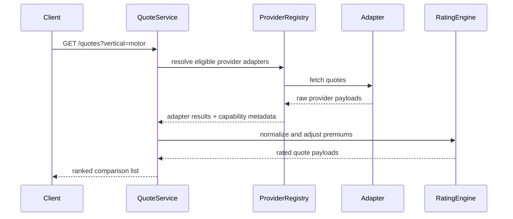

# Khaacho Quote Engine

## Overview

The Khaacho quote engine is designed as a provider-neutral orchestration layer:

- QuoteService coordinates the quote request lifecycle.
- ProviderRegistry resolves eligible insurers or adapters.
- ProviderAdapter exposes a uniform contract for quote retrieval and capability reporting.
- RatingEngine applies only commercial logic after the raw provider response has been normalized.

This keeps the flow vendor-agnostic while preserving operational safety and explicit capability reporting.

## Provider adapter contract

Each adapter must implement the following responsibilities:

- validate incoming normalized request data
- return quote payloads in a common raw response format
- declare supported/unsupported capabilities explicitly
- avoid pretending to support APIs it cannot fulfill

```ts
export interface InsurerAdapter {
  readonly name: string;
  readonly quoteSource: 'REAL_TIME' | 'INDICATIVE' | 'MANUAL';
  getQuotes(request: QuoteRequest): Promise<AdapterRawResponse[]>;
  getCapabilities(): ProviderCapability[];
}
```

Provider capability metadata is required to make operational behavior honest and auditable:

```ts
export interface ProviderCapability {
  capability: string;
  supported: boolean;
  reason?: string;
}
```

Examples of supported and unsupported capabilities include:

- supported: getProducts, validateQuoteRequest, getQuote
- unsupported: createApplication, uploadDocument, issuePolicy

Unsupported capabilities are never silently treated as supported.

## Quote lifecycle

1. Request is normalized into a QuoteRequest DTO.
2. Active insurer partners are selected for the vertical.
3. Each provider adapter is instantiated and queried.
4. Provider response is normalized into AdapterRawResponse.
5. RatingEngine adjusts premiums using only approved commercial logic.
6. The final quote is ranked and returned with provider capability metadata.
7. Source metadata, provider, and supported/unsupported features remain visible to staff and downstream systems.

## Source types

- REAL_TIME: live insurer connectivity or simulated live provider response
- INDICATIVE: approximate pricing or non-binding estimate
- MANUAL: staff-entered or assisted quote, never shown as insurer-generated

The quote engine must explicitly preserve the quote source and not infer it from UI labels.

## Failure handling

The system treats partial provider failure as a valid operational outcome:

- failed adapters are isolated from successful ones
- unsuccessful responses are logged without crashing the full comparison result
- the request still returns the quotes that were successfully gathered
- unsupported capabilities are surfaced as explicit metadata instead of being hidden

This avoids a single provider outage from breaking the whole comparison experience.

## Normalized response shape

The normalized result is intentionally provider-neutral and contains:

- provider name
- provider capabilities
- source type
- insurer name and plan name
- premium and formatted premium
- coverage summary
- claim settlement ratio
- exclusions
- best-match flag

```ts
export interface NormalizedQuoteResult {
  id: string;
  provider: string;
  providerCapabilities: ProviderCapability[];
  quoteSource: QuoteSourceType;
  insurer: string;
  plan: string;
  premium: string;
  premiumValue: number;
  coverage: string;
  csr: string;
  exclusions: string[];
  isBestMatch: boolean;
}
```

## Sequence diagram



## Operational rules

- Do not invent new provider APIs.
- Do not show fake insurer pricing as live quotes.
- Do not mark a manual quote as insurer-generated.
- Keep the first launch motor-only.
- Preserve the legacy UI response shape where needed, but add normalized metadata for internal integrity.
